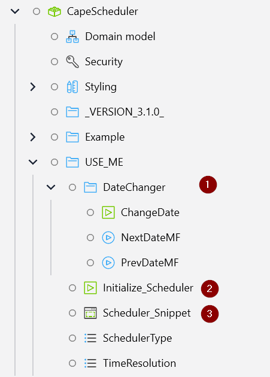
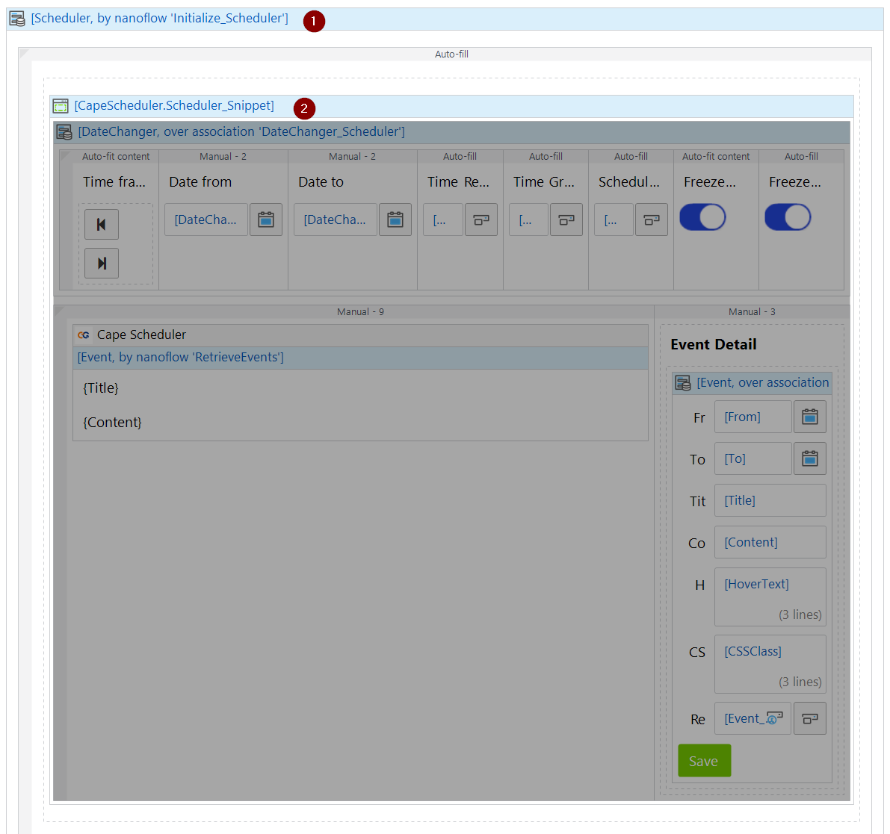

📆 Cape Scheduler
===============	

Cape scheduler is the most powerful **resource scheduler** available on Mendix platform.

Resource scheduling involves the identification and allocation of the necessary resources to accomplish a particular task within a specified timeframe. This process enables you to assign tasks based on the skills and availability of team members, thereby preventing either underutilization or overutilization of resources.

## Demo Application
https://capescheduler-sandbox.mxapps.io/index.html?profile=Responsive

# Features 🚀

1. Customizable event layout. 
2. Adjustable time resolution & grouping. Show schedule in minutes, hours, daily 
3. Time header can be in row or in column. 
4. Capable of showing working hours and holidays. 
5. 2nd level Resource grouping. 
6. Add your own context menu, outside and inside event!
7. Optional capabilities to Drag & Drop, & resize to adjust time.
8. Row & Column freezing
9. Easy to use CSS class to completely change the widget look and feel.

# Using the Cape Scheduler

## The basic concept

1. ResourceGroup Header row
2. Resource Header row
3. Date column
4. Time / TimeGroup column
5. Event
6. Event Title
7. Event Content
8. Resize handle `Start`
9. Resize handle `End`
10. Hover text
11. Holiday / freeday

## The first step

1. Download the `Cape Scheduler` module from Mendix store. The module contain the essential mendix side block to use the widget. Important: The module does not contain the widget!
2. Ask Cape Groep servicepoint@capegroep.nl for access to the widget. 

## The module structure

When you downloaded the module, you will be presented with the following structure in your `Marketplace modules`. The most important part is inside the USE_ME folder. You can **copy** the `DateChanger` folder, `Initialize_Scheduler` and `Scheduler_Snippet` to your own module.

1. `DateChanger` folder is neccessary to customize if you want custom timeframe. 
2. Adjusting `Initialize_Scheduler` might be required for advance features.
3. `Scheduler_Snippet` contain the basic structure to use the widget.

## The Domain Model

You can either create generalization of the model, use as-is or copy the model into another module. 

The benefit of using Generalization or copy the model is separation of concern. furthemore you can can customize the domain model with custom attributes. You will not have to worry when it's time to update the module.

In this example (and on the provided `Scheduler_Snippet`) we will use the module as is. 

The most important part of the domain model is 
1. ResourceGroup (Not required if you disable Resource group function)
    1. `Name`*: The name of the resource group
    2. `Order`*: The display order of the resource group. lower number will be displayed more left that higher number. 
2. Resource*
    1. `Name`*: The name of the resource
    2. `Order`*: The display order of the resource. lower number will be displayed more left that higher number.
3. Event*
    1. `From`*: The start time a resource will be used by the event. 
    2. `To`*: The end time a resource will be used by the event
    3. `Title`*: The name of the event.
    4. `Content`*: Additional information related to the event.
    5. `CSSClass`*: Dynamically inject CSSClass to the scheduler. 
    6. `HoverText`*: What to shown when user 
4. Holiday*
    1. `Date`*: When the holiday occurred
    2. `Description`*: The name of the holiday. Will be shown as hover text

You will need to create microflows to fill in the entities described. Resource is **Mandatory** and cannot be empty.  

## Using the snippet 

You can customize the look of the widget by modifying the snippet

1. The root of the snppet must be the scheduler entity
2. The widget control use the DateChange entity
3. You can add / remove control as you like.
4. Is the main CapeScheduler Widget.
4. Customise the content of the scheduler by adding / removing additional widget. 
5. When you click a content, by default the widget will show event detail. You can remove this if necessary. 

## Example pages using the snippet

1. Use the `Initialize_Scheduler` nanoflow to create the scheduler object
2. Pass the `Scheduler` object into the snippet

# Advance usages

## Add recurrent non working days

With this feature, you can mark certain day as non working days. 

1. Open The Non Working days tab in the widget configuration 

2. Click new
3. Add the day name and the day description. The description will be shown as hover text. 

## Add custom context menu

1. Open the Action configuration 

2. Click new

If you want the context menu available when the user right click the event, choose event. If you want the context menu available when the user click outside the event, choose empty row. if you want the menu always shown, choose both. You can put arbitrary value in event key. However, it must be unique. We suggest to put the following format `[ACTIONNAME]_CONTEXTMENU`. Display value is what will be displayed under the context menu.

3. The onEvent microflow will be triggered when you click the context menu. You need to implement the `[ACTIONNAME]_CONTEXTMENU` handler there.  

1. Route to the action
2. `[ACTIONNAME]_CONTEXTMENU` will be in EventType
3. Your custom event handler. 

## Modify Date / Time format

If you like to customize the date/time format, got to the Time Configuration tab and change the date format. If you need to change it dynamically, you can add Date / time format as new properties in scheduler object. use the following documentation to view available format https://date-fns.org/v2.16.1/docs/format

## Modify working hours
The default is 9 to 5. If you need different working hours you can change it in the time configuration page of the widget. 

## Show resource group
You can enable or disable second level resource by going to the resourcegroup tab. Important! If you enable resource group, all of your resource must be a member of a group. Resource group cannot be empty.

## Modify Dimensions

You can change the row & column dimensions by going to the dimensions tab. Be aware that some configuration only works when in `TIME_IN_ROW` mode or in `TIME_IN_COLUMN` mode. 

## Custom SCSS 
This widget is also an UI resources module. you can add custom sccs to change the widget look and feel

The most important part is the `color.scss`. You can add custom color for event there. Furthermore if you need to change the look and feel of the entire widget, you can modify `scheduler.scss`. Basic coloring options is available as SCSS variables there. 

# Contact us
CapeGroep <servicepoint@capegroep.nl>